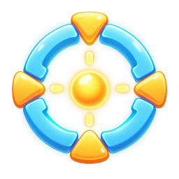

# Captain Toad: Treasure Tracker VR

**Alpha 1.11** · Windows x64 · Cemu · OpenXR

Stereo rendering and six-degree-of-freedom head tracking for the Wii U
version of **Captain Toad: Treasure Tracker**. Play with a gamepad or VR
controllers in diorama, close diorama or first-person mode.

[Installation](INSTALL.md) · [Known issues](KNOWN-ISSUES.md) ·
[Build from source](BUILD.md) · [Credits](CREDITS.md)

## Choose a mode

| Mode | Selection | View |
| --- | --- | --- |
| **Diorama** | Default on start | View the level as a diorama and touch it with the right VR controller. |
| **Close diorama** | Press gamepad X or click the right VR stick once | The same diorama from half the distance. |
| **First person** | Press the same button again | View from Toad, with free 360-degree stick turning. |

Run `Start-VR.cmd`. In a level, press **gamepad X** or click the **right VR
stick** to cycle Diorama → Close diorama → First Person → Diorama. Left X
on a Quest/Touch controller also cycles the views. Entering first person
recentres your headset position. To recenter again and straighten the view,
use **gamepad R3** or **left VR stick click**. Title screen, level book and
menus are shown on a screen that stays fixed in the room.

All modes include room-anchored menus and HUD, head tracking, and the VR
controllers as the GamePad, touch screen included.

## New in Alpha 1.11

- Fixes VR stopping after roughly ten minutes, depending on the refresh rate.
- Keeps rendered frames matched to their original headset poses when the internal
  pose tokens wrap, and rejects expired pose-history entries.
- Keeps the touch hand, stun fist and crosshair matched to their frames after
  the token wrap.

## New in Alpha 1.1

- SteamVR compatibility fix by **Anakins** for runtimes that select an sRGB
  swapchain, including the matching HUD texture import.
- Converts eye and HUD colours when the runtime requires sRGB; keeps the
  existing UNORM transfer unchanged. Headset comparison is pending.
- Head-based movement in first person: the left stick follows the horizontal
  headset direction with responsive smoothing, for gamepads and VR controllers.
  Looking up or down does not change movement speed. Minecart aiming keeps its
  existing controls.
- First-person touch interaction with target-specific icons: a fist for
  recognized enemies, a pointing hand for lifts and platforms, and the
  existing minecart crosshair. Markers follow the nearest collision surface.
- Hides GamePad touch, tilt and right-stick tutorial banners in VR.

See [release notes](RELEASE_NOTES.md) and [known issues](KNOWN-ISSUES.md)
for test coverage and remaining limitations.

## Features

- **Stereo rendering with head tracking** through OpenXR, on the game's own
  render flow: one simulation step, two eye views.
- **Diorama, close diorama and first person** on one button. The close
  diorama shows the level from half the distance. First person sits at
  Toad's head with a levelled horizon, hides his model and turns freely with
  the right stick.
- **VR controllers as the GamePad** with no button mapping in Cemu. The right
  controller points at the level and its trigger touches it where the Wii U
  touch screen would; in the minecart the crosshair follows the controller
  and the trigger fires.
- **Touch from the pad:** hold Y and switch between the nearby lifts and
  movable platforms with the D-pad; a hand marks the chosen one, releasing Y
  touches it.

See [release notes](RELEASE_NOTES.md) for details and [installation](INSTALL.md)
for controller bindings. Rendering and controls still have limitations;
see [known issues](KNOWN-ISSUES.md).

## Get started

1. Download the **Alpha 1.11 installation ZIP** from [Releases](../../releases).
2. Place its `CaptainToad-VR` folder beside `Cemu.exe`.
3. Close Cemu and run `Start-VR.cmd`.
4. Open Captain Toad: Treasure Tracker in Cemu and play with your gamepad or VR controllers.

Use the installation ZIP to play. GitHub's **Code → Download ZIP** contains
source code and requires building the VR layer first.

See [INSTALL.md](INSTALL.md) for headset setup, graphics settings and FPS options.

## Requirements

| Component | Supported / tested configuration |
| --- | --- |
| System | Windows x64 |
| Emulator | Cemu **2.6**, Vulkan renderer |
| Game | Wii U game with update **v16** installed |
| Game identifiers | Title ID `0005000010180700` · module checksum `1B377483` (update v16) |
| VR | An active OpenXR headset runtime |
| Input | A configured gamepad or supported OpenXR VR controllers; emulated controller 1 must be a Wii U GamePad |

Headset testing used an RTX 4080 and Virtual Desktop/VDXR at 120 Hz.
Other hardware, runtimes and game versions have not been validated.
Cemu and the game are not included.

## Controls

Head movement looks around and moves your viewpoint in VR. The HUD stays in
the room as you turn, and head tracking remains separate from stick turning.
In the gamepad section, button names are the Wii U GamePad's, as Cemu's
input settings show them. Buttons not listed there work as in the game.

### Gamepad

Use your existing Cemu gamepad mapping. Toad has custom camera and touch
controls listed below; all other buttons keep their standard game actions.
**X and Y here mean the emulated Wii U buttons**, which may have different
labels on your physical gamepad.

| Input | Action |
| --- | --- |
| Zoom button (X) | Step through Diorama, Close diorama and First Person |
| R3, first person | Recentre head position and straighten the view |
| Right stick, first person | Turn freely through 360 degrees |
| Left stick, first person | Move relative to the horizontal headset direction and stick turning |
| Y held + D-pad left/right | Choose a nearby lift or movable platform; a hand marks it |
| Release Y | Touch the chosen one; a short press touches the nearest |
| Right stick | Aim in the minecart and turn the Spinwheel; in first person hold Y for either |
| Y or ZR | Fire in the minecart |

### VR controllers (motion controllers)

VR controllers have their own bindings; no button mapping in Cemu is
needed for them. Set emulated controller 1 to **Wii U GamePad**. The button
names below refer to **Quest / Oculus Touch controllers**, not to the
gamepad table above. Other controller layouts have not been validated.

| Input | Action |
| --- | --- |
| Left stick | Move |
| Right stick | Look; in first person turn freely through 360 degrees |
| Left X, right stick click | Step through Diorama, Close diorama and First Person |
| Left stick click | Recentre head position in first person |
| Right controller, pointing | Aim the touch hand in diorama or first person; aim the crosshair in the minecart |
| Right trigger | Touch where the right controller points; fire in the minecart |
| Left controller held to your head | The right stick acts as the D-pad; a short pulse confirms it |
| Left Y held + right stick left/right, left controller at your head | Choose a nearby lift or movable platform; releasing Y touches it |
| Left trigger, left grip, menu button | ZL, L, Plus |
| Right A, right B, right grip | A, B, R |

See [INSTALL.md](INSTALL.md#controls) for the full bindings and separate
gamepad and VR-controller instructions.

### The touch hand, stun fist and crosshair

Three symbols of this mod stand in for the GamePad's touch screen. They are
drawn in the room by the VR layer, at the depth of the spot they mark, and
only while they are in use.

|  |  |  |
| --- | --- | --- |
| **Touch hand:** marks the touch point or the selected lift/platform. | **Stun fist:** marks a recognized enemy target for touch-stunning in every camera mode. It indicates the target, not a confirmed stun. | **Crosshair:** shows the direction of aim in the minecart. |

With a gamepad, hold **Y** and use **D-pad left/right** to choose a nearby
lift or platform, then release Y to touch it. With VR controllers, point
the right controller and hold its trigger to touch in either diorama view
or first person. In first person the hand is visible before pressing the
trigger so you can aim at enemies for touch-stunning. This new path awaits
headset testing. This test build places the hand and minecart crosshair at
the nearest collision point, falling back to their reference distance when
no hit is available. Collision shapes may differ from visible models.
The pointer uses a fist when its nearest target is recognized as an enemy,
in every camera mode. Lifts, platforms and other targets use the pointing hand;
the minecart keeps its crosshair. The fist indicates the target, not stun success.

In the minecart, aim with the gamepad's right stick or the right VR
controller. In first person, hold gamepad Y to aim with the stick.

All three are this project's own artwork; the originals are under `core/assets/`.
See [INSTALL.md](INSTALL.md#the-touch-hand-and-the-crosshair) for the details.

## Frame rate

The default preset targets **120 rendered stereo pairs per second** while
keeping gameplay updates near **60 Hz**. It does not interpolate character
motion between gameplay updates. Actual frame rate depends on your system.

A 60 FPS reference preset is available; 90 and 144 FPS are experimental.

## Alpha status

This is an early, incomplete release. A full playthrough has not been
validated. Camera behavior, visibility, effects and scene transitions can
have problems, especially in first person. See [KNOWN-ISSUES.md](KNOWN-ISSUES.md)
for limitations and what to include in a bug report.

## Credits and license

Created by **Destroyjevski**.

Huge thanks to **Crementif and the BetterVR contributors** for their excellent
work on Cemu VR. Their research and implementation provided an important
technical foundation for this project. See [CREDITS.md](CREDITS.md) for
acknowledgements and implementation background.

Original project code is licensed under [MIT](LICENSE). Third-party licenses
are included in [licenses/](licenses/); see [THIRD-PARTY.txt](THIRD-PARTY.txt)
for a dependency and license summary.

## Unofficial project

This project is not affiliated with or endorsed by Nintendo, Cemu or BetterVR.
Game names, characters and assets belong to their respective rights holders.
Users must provide their own legally obtained game. The package contains no
game dump, keys, firmware, saves or extracted game assets.
